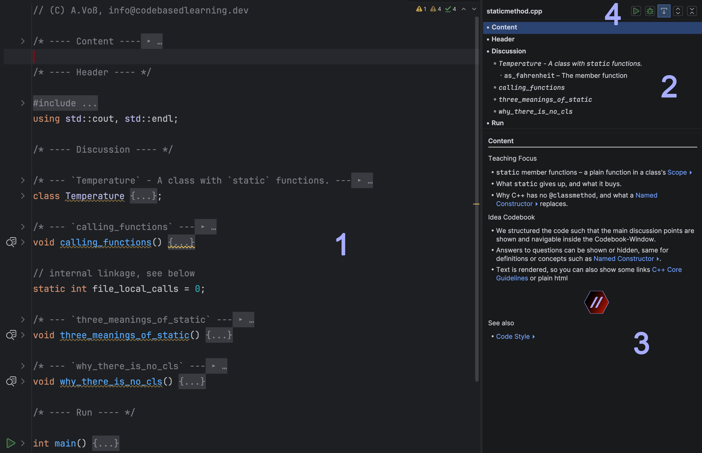
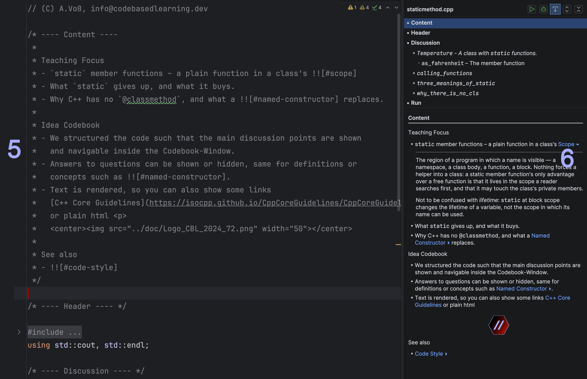
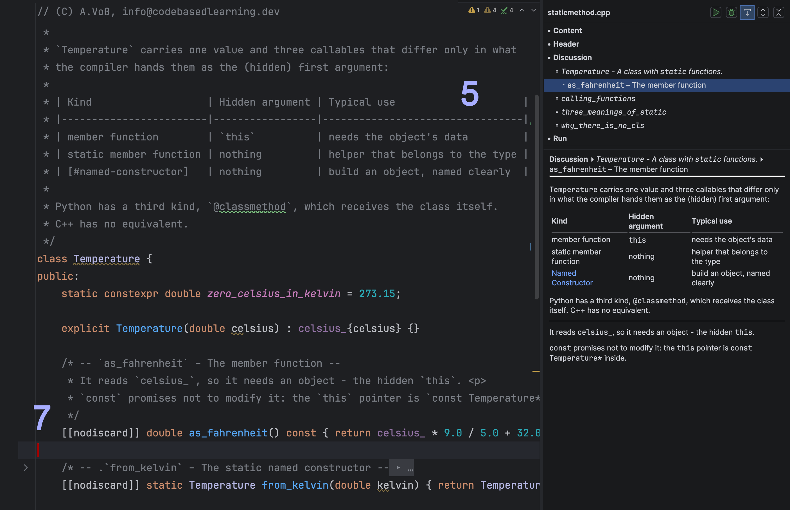
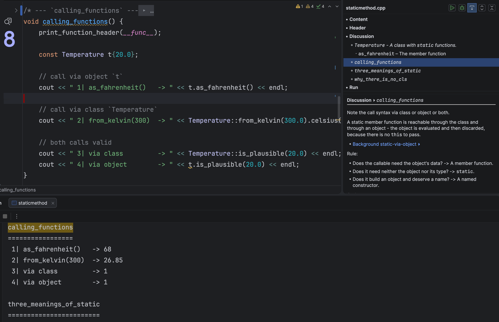

[© A.Voß – codebasedlearning.dev – Study Maths and Computer Science (AMI) with us @ FH Aachen](https://ami.codebasedlearning.dev)

# Codebook

## Overview

This is a JetBrains IDE plugin for teaching and learning programming at a code 
level. 

The plugin converts didactic comments in code snippets into a structured side panel 
and folds them away in the editor, ensuring the code remains readable while the 
prose remains accessible.  
The side panel also provides access to further information, such as glossary entries 
or answers to questions. This helps to focus on the discussion at hand while 
simultaneously providing access to additional resources.

## Codebook live

### Overview

- Source code on the left (1), all folded with multiple multiline comments. 
  Some of these occur at different indent levels. 
- The Codebook view's upper pane (2) is on the right. The idea is to use 
  a form of comment that is often used to structure code. The level depends 
  on the number of '-', so '----' is the top level. 
- In the lower Codebook view pane (3), the current code comment block 
  (red caret) is unfolded and displayed (the next image shows the comment 
  unfolded). Additionally, all comments 'above' the current comment level 
  are also shown, so that the context can be seen too.
- In the top right corner is the Codebook Control (4), which has buttons 
  for 'Run', 'Debug', the 'Detail View follows Cursor' switch, 'Fold' and 
  'Unfold all'.

### Comment unfolded I

- Here, the 'Content' comment is expanded to show what is visible in the 
  Codebook view pane. Markdown links and formatting are respected (6). 
- Alongside the standard references, i.e. `[description] (doc#ref)` and 
  the `!` form for embedding, there is a third form, `!!`, which is displayed 
  as a foldable block in the Codebook view pane. Here, it is labeled 'Scope'. 
  This allows 'detail' blocks to be opened on demand for further references 
  or answers to questions for the auditorium. These blocks originate from 
  glossary files. So, with this one, you can place the main information in 
  the code and easily refer to other resources at hand, e.g. 'Scope',
  'Named namespace' and 'Code style'.

### Comment unfolded II

- This time, the source code window on the left (5) shows an unfolded class 
  comment with a table, as before.
- The cursor is positioned below `as_fahrenheit` and the details pane on 
  the right shows the hierarchically collected information from the class 
  and the member function.
- Note also that `as_fahrenheit` is a child of the class in the overview pane 
  on the left, whereas `from_kelvin` is hidden due to the leading '.'
  This allows you to be part of the information tree without cluttering the 
  overview and helps you to stay focused.

### Output

- When explaining concepts, we demonstrate the effects live. 
  Therefore, some of the output relates to the code currently being investigated. 
  The gutter icon (8) to the left of the function selects the relevant part 
  of the output. This reduces the need to scroll.

## Configuration

- Course conventions live in `cbl.properties` files, searched upwards from the
  current source file.
- Most of it is configured using regular expressions, so the '-'-form, 
  e.g. `---- Content ----`, is not fixed.

## Installation

- From disk/repo: `Settings → Plugins → ⚙ → Install Plugin from Disk…` with the
  signed zip from the repository (`Releases`).
- Marketplace: listing planned.

## Samples

Three self-contained sample projects
- [`sample-cpp/`](sample-cpp/),
- [`sample-python/`](sample-python/) and 
- [`sample-kotlin/`](sample-kotlin/)

cover the same topic (static methods) on purpose, so the panel can be compared
across languages. Glossaries are per language, so nothing has to stay in sync.

Writing your own snippets: see [AUTHORING.md](AUTHORING.md).

## License

[MIT](LICENSE)
