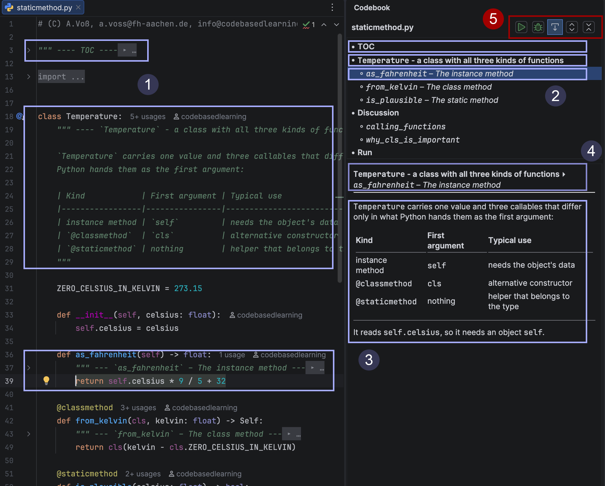
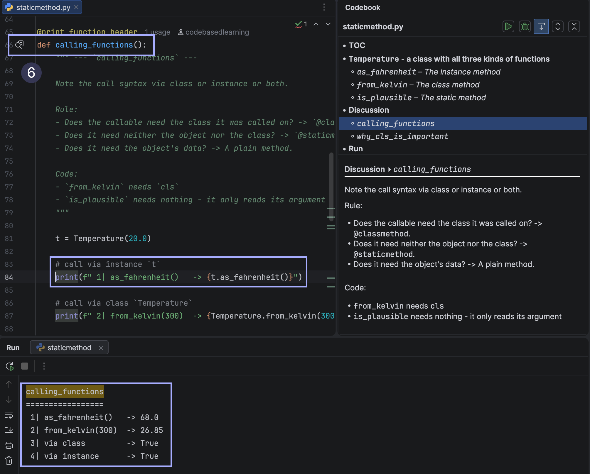
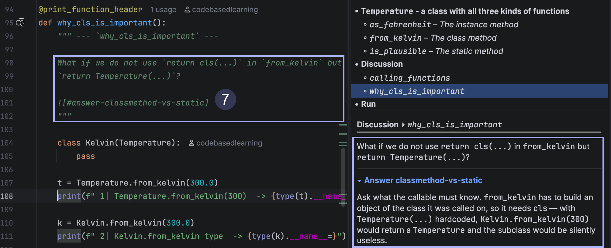
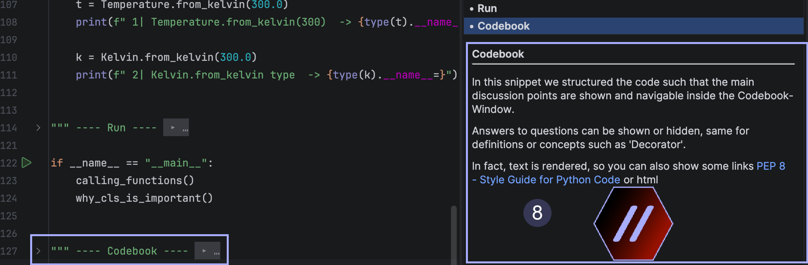
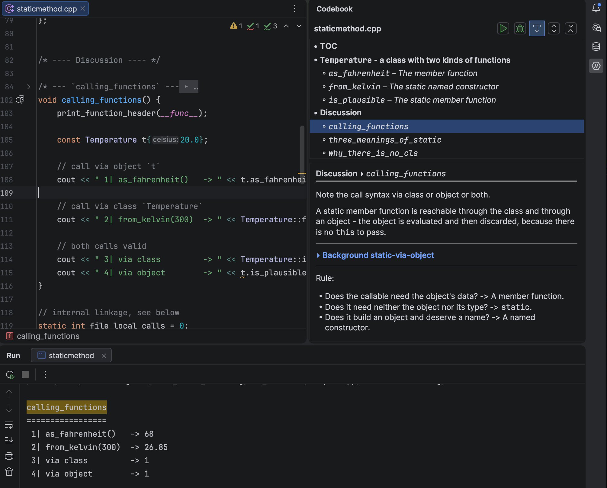

# Codebook

## Overview

A JetBrains IDE plugin (CLion, PyCharm, IntelliJ IDEA, …) for
[code-based-learning](https://www.codebasedlearning.dev) courses: it turns
didactic comments in course snippets into a structured side panel — and folds
them away in the editor, so the code stays readable while the prose stays
available.

### Comment Collection



- Headlines (1) from Python multiline comments (folded and unfolded), listed in (2) -> Overview and Code Navigation
- Comments content hierarchically collected (3) -> Detail View
- Breadcrumb (4) -> Detail Level
- Codebook Control (5) -> Run/Debug, Detail View follows Cursor, Fold- and Unfold all

Course snippets are literate programs: the explanation lives in comments next
to the code it explains. The plugin renders that structure instead of letting
it compete with the code for screen space.

One zip installs in every JetBrains IDE. The plugin uses no language-specific
API — it reads the comment tokens the IDE already produces, so it works
wherever the IDE understands the language (C++, Python, Kotlin, …).

### Output Selection



- When explaining language and concepts, we demonstrate the effects live. Therefore, 
some of the output relates to the code currently being investigated. The gutter icon (6) 
to the left of the function selects the relevant part of the output.

### Answers, background and Details



- Often, there is a need to hide or show additional details. But the code should be 
kept as small as possible to stay focused, e.g. for questions and answers, further links or 
background information. Here, we can reference a text block from an additional glossary 
Markdown file, and the corresponding block can be displayed in the comment on the right (7).

### Graphics



- Graphics and links can also be embedded (8).

### C++



- The same goes for C++ and Kotlin for now.


## Writing blocks

A **CBL block** is a *block comment* whose first non-blank interior line is a
dash-framed title. The frame is what you would draw on a whiteboard anyway, and
it reads as a section header even in an editor that knows nothing about
Codebook. Depth is the **width of the frame** — four levels:

```
/* ---- Topic ----     level 1     bold in the outline
   /* --- Child ---    level 2     italic
   /* -- Detail --     level 3
   /* - Aside -        level 4
```

The framed text is the **title**; the remaining interior lines are the **body**,
rendered as Markdown. Text after the frame *on the same line* becomes the first
body line, so a one-liner is a complete block:

```cpp
/* --- The member function --- it reads celsius_, so it needs an object.

   `const` promises not to modify it - the `this` pointer is
   `const Temperature*` inside. */
[[nodiscard]] double as_fahrenheit() const { return celsius_ * 9.0 / 5.0 + 32.0; }
```

Python uses the triple-quoted form, `""" … """` or `''' … '''`:

```python
@staticmethod
def is_plausible(celsius: float) -> bool:
    """ --- The static method --- no self, no cls: a plain function in the
    class's [#namespace].

    It validates a value without needing any object at all.
    """
    return -273.15 <= celsius <= 5000.0
```

One block comment is one block; nothing merges, and there are no end markers —
a block extends until the next one or the end of the file. The header need not
sit on the opening line, so a Javadoc-style opening works too:

```cpp
/**
 * ---- Static member functions ----
 *
   This snippet discusses `static` member functions … */
```

A title starting with a **dot** marks the block as *unlisted*: it appears
neither in the outline nor in the breadcrumb — the two places that tell a reader
where they are — while everything else about it stays the same: notes, folding,
and refs (the dot is a marker, not part of the title, so `.Setup helpers` is
still addressed as `[#setup-helpers]`). Its notes still stack under the caret,
and since no crumb names it, they are headed by its own title instead. Use it for scaffolding a file needs but a
reader should not have to walk past. Children of an unlisted block are listed as
usual.

```cpp
/* ---- .Setup helpers ---- includes and boilerplate, not a topic of its own */
```

### What is *not* a block

Deliberately narrow, so the DSL collides with nothing you already write:

| Form | Why it is an ordinary comment |
|---|---|
| `/* ----- Banner ----- */` | five or more dashes — wider runs stay banners |
| `/* ---- Title --- */` | asymmetric frame: both sides must match exactly |
| `/* -------- */` | no title, so it is a separator |
| `// ---- Title ----` | line comments are never blocks, by design |
| `int n = 0; /* ---- x ---- */` | trailing comment — the block comment must be the first thing on its line |

Markers are ordinary comments throughout: they never break compilation, and in
an editor without Codebook they degrade to exactly what they look like.

### Where to put the comment

The convention differs per language, on purpose:

- **Python — use the docstring.** A bare string statement above a `def` is not
  idiomatic (Pylint flags `W0105 pointless-string-statement`), and having the
  didactic text show up in quick-doc is a feature in teaching material. Asides
  *inside* a function body are plain string statements — there is no docstring
  position for them.
- **C++, Kotlin — the comment sits above the definition.** There is no
  docstring position.

Both behave identically in the panel: a block whose comment opens a construct
(the line above ends with `:` or `{`) owns that opening line, so putting the
caret on a signature selects the block that documents it — **unless a CBL
comment stands directly above that line**, in which case the line belongs to it:

```cpp
/* --- namespace --- */
namespace {
    /* --- `define_and_init` --- */
    void define_and_init() {
```

The caret on `namespace {` selects *namespace*, the caret on the function
signature selects *define_and_init*. Without the exception the inner block would
swallow the very line the outer comment was written for.

## Notes are Markdown

GitHub-flavoured: bold, italics, inline code, lists, fenced code — and
**tables**, which is why GFM rather than plain CommonMark (comparison tables are
a teaching staple, and CommonMark has none). Keep tables narrow; the panel is
not wide.

Images work via ``, resolved relative to the folder of the
source file. Lists use `-`: a leading `* ` is stripped as boxed-comment
decoration, while `*`/`**` emphasis survives.

**Indentation is relative.** The body's common indent is removed — a comment
nested ten columns deep in a method reads like a document that starts at the
left margin — and anything indented *further* keeps the difference, so sub-lists
nest as they do anywhere else:

```cpp
/* ---- Two core design principles ----
   - 'zero overhead': you only pay for what you use
     - virtual only where you ask for it
   - 'const correctness': `const` unless observable state changes */
```

Two Markdown rules are easy to trip over here, both inherited, neither ours:
changing the bullet character (`-` → `+`) starts a *new* list, and a blank line
inside a list makes it loose (paragraph gaps around every item).

## References and embeds

Two forms, straight from Markdown, addressing other blocks by their title slug
(lowercase, non-word runs → `-`, exactly like a GitHub heading anchor):

```
[the static method](#the-static-method)     a reference: click selects the block
                     an embed: the body is spliced in here
```

A `:` separates a qualifying ancestor chain — `[code style](#final-remarks:code-style)`
— whose segments must match a suffix of the target's real chain. Unqualified
references resolve to the first title match in file order.

**Cross-file:** `path#fragment`, relative to the current file.

```
[TCO](doc/glossary.md#tail-call-optimization)

```

An embed splices the target's text in (relative images are rebased to the
foreign folder, and so are the links: a `[text](#other)` inside an embedded
glossary entry means *that* glossary's `#other`).

**Clicking** a ref into a Markdown file does not open that file — it shows the
section in a **peek** frame below the notes, so a lookup costs neither a tab nor
your place in the snippet. The same link closes it again, a link inside the peek
replaces its content, and the ⚐ in the peek header opens the file in the editor
when you really do want to go there. Refs into *code* files navigate as before:
Markdown is reading material, code is where you work. Code files are read through the
parser; **Markdown files have no comments, so ATX headings are the blocks
there** — `## Code Style`, depth = heading level. Slugs equal GitHub's anchors,
so the same links work when reading the repository online.

**Short forms** — brackets without parentheses — cover the glossary case that
dominates in practice:

```
[#main-guard]      reference; the link text is the target's title
![#main-guard]     embed, folded until clicked
!![#main-guard]    embed, pinned open
![../notes.md#tco] an explicit path still works
```

The second `!` says *include this*, not *offer this*: same frame and headline,
but no arrow and nothing to click — a transclusion of text that belongs here and
is merely kept in one place, as opposed to a question the reader unfolds when
they are ready. The fold state is not consulted at all, so Fold-all leaves it
alone.

A path-less fragment is looked up along `glossary.path` (see below), in order,
the current file last. Both forms are valid CommonMark shortcut references, so
a foreign renderer prints the literal text instead of mangling it.

**Labels** — a block can declare its own address, as a trailing anchor in the
header:

```
## Background Const                     <a id="acdf"></a>
```

An ordinary HTML anchor, nothing invented: every Markdown renderer passes it
through and shows *nothing*, so headings stay clean in exports and on GitHub —
where it is a real anchor as well (`#user-content-acdf`). It can be tabbed far
to the right, out of the way of the prose. `name=` is accepted alongside `id=`,
and the closing tag may be omitted (`<a id="acdf">`) — though only the closed
form is valid HTML5, so write it closed for anything that leaves the IDE.

`[#acdf]` now addresses that block, and the title slug (`background-const`) no
longer does — the label *replaces* it, so rewording the heading cannot silently
break or re-point a ref. The label is stripped from the title, so everything
that shows a title shows the front part alone: the outline, the breadcrumb, the
embed frame, and the link text of `[#acdf]`, which renders as
[Background Const]. Headers without a `[#label]` keep addressing by title slug,
exactly as before.

### Question blocks

No extra syntax needed: put the answers in a second file on the path and write a
one-liner whose body is a folded embed.

```cpp
/* ---- Why does this not compile? ---- ![#const-ref-answer] */
```

Embeds render **folded** by default, so the answer is one click away and,
unlike a marker inside the snippet, genuinely not in the student's file. Name
the answer sections neutrally (`## Answer 0x02-3`) — a folded embed on a line
of its own shows its target's title, so `## Because m is const` would spoil
itself.

**Inline embeds:** an embed with text in front of it on the same line stays
*in* that line — it renders as the target's headline followed by a `▸`, right
where it stands, with no frame and no line break:

```
What prints `cout << v1`? ![#answer-init-value]
```

Clicking flips the arrow to `▾` and shows the body in the usual frame directly
below the paragraph (block content cannot live inside a sentence); the frame
carries no headline of its own, since it already stands in the sentence above.
Position is the only difference between the two forms; there is no extra syntax.

Which means the headline is what a reader sees before deciding to unfold — so
it must not answer the question by itself. Either keep answers neutrally named
(`## Answer 0x02-3`) or let the headline repeat the question.

## The tool window

Docked right, one tab, three parts:

- **Header** — file name, Run and Debug (derived from the current file's
  context), a follow-caret toggle, and unfold-all / fold-all.
- **Outline** — every block in file order, showing its level three ways at once:
  bullet (`•`/`◦`/`·`), indent, and emphasis (**bold**, *italic*, plain below).
  With follow-caret on, a single click jumps to the block; with it off, a single
  click only selects and shows the notes, a double click jumps.
- **Notes** — a breadcrumb line (`Topic ▸ child ▸ detail`) over the bodies of
  *all* layers in the chain, outermost first, separated by thin dividers. So the
  topic set at the demo function stays visible while you read the detail under
  discussion.

Follow-caret (on by default) makes selection and notes track the block above the
caret; switch it off to keep the panel put while working in the code.

## Editor folding

The **note body** folds away — from the end of the frame line to the end of the
comment — while the frame line stays visible as ordinary source. A folded file
therefore reads as a table of contents interleaved with code:

```cpp
/* ---- A class with all three kinds ---- ▸ …
class Temperature {
```

Fold-all and unfold-all act on CBL comments **only** (author mode vs.
presentation mode), which is the one thing the IDE's native Expand/Collapse All
cannot express. Fold state survives re-parsing, and a block you are currently
editing stays open — IntelliJ always expands the region containing the caret.

Single-line comments get no region; there is nothing to hide.

## Output linking

After a run, the Run console is parsed for section headers — by default a name
line underlined with `=`:

```
using_print
===========
```

If a section name also occurs in the source file, its first occurrence gets a
gutter icon; clicking it opens the Run window, scrolls to that section and
highlights the header line.

There is **no output verification**. Output is illustration, never judge.

## Course configuration (`cbl.properties`)

Course conventions live in `cbl.properties` files, searched **upwards** from the
current source file and cascaded like `.editorconfig`: every config between the
file and the project root contributes, nearer files override **per key**. A
chapter only sets what it changes; the rest is inherited from the course root,
and built-in defaults fill the remainder. The search stops at the project root,
so a stray file in a home directory cannot leak in, and the configs travel with
the repository — every student clone behaves the same.

Format: `key = value`, `#` for comments, values taken **verbatim** (no backslash
escaping, so regexes are written as-is). Changes apply on save.

| Key | Meaning |
|---|---|
| `block.level1.regex` … `block.level4.regex` | the header pattern per level. Must capture `(?<title>…)`; the optional `(?<rest>…)` picks up text after the frame on the same line. Levels are independent — redefining one inherits the other three. |
| `output.section.regex` | how console output is split into sections. Must bind `(?<name>…)`; the match position marks the section start. |
| `glossary.path` | comma-separated **search path** for path-less short refs, first hit wins. Entries resolve relative to the declaring `cbl.properties`, so one course-root entry serves every chapter depth. |

```properties
# use '=' frames for the two top levels, keep dashes below
block.level1.regex = ^={4}(?!=)\s*(?<title>\S.*?)\s*(?<!=)={4}(?!=)\s*(?<rest>.*)$
block.level2.regex = ^={3}(?!=)\s*(?<title>\S.*?)\s*(?<!=)={3}(?!=)\s*(?<rest>.*)$

# a glossary plus an answer file
glossary.path = ./doc/glossary.md, ./doc/answers.md
```

An invalid pattern — uncompilable, or missing its capture group — produces a
warning notification and leaves that key at its built-in default.

What is configurable is deliberate: the *shape* of a header is a course
convention and has a key; its *meaning* (block comment, four levels, framed text
is the title, the rest is a Markdown body) is the language and has none.
`sample-cpp/cbl.properties` is the fully documented reference, with every key
listed at its default and commented out.

## Install

- **From disk:** `Settings → Plugins → ⚙ → Install Plugin from Disk…` with the
  zip from `plugin/build/distributions/`, built via
  `./gradlew :plugin:buildPlugin`.
- **Marketplace:** listing planned.

## Samples

Three self-contained sample projects — [`sample-cpp/`](sample-cpp/),
[`sample-python/`](sample-python/) and [`sample-kotlin/`](sample-kotlin/) —
cover the *same* topic (static methods) on purpose, so the panel can be compared
across languages. All three use the same layout: `snippets/` for the code with
`snippets/utils/` for shared helpers, `doc/` for `glossary.md` and `answers.md`,
and a `cbl.properties` at the root. Glossaries are per language, so nothing has
to stay in sync.

```bash
cd sample-python && uv run snippets/staticmethod.py
cd sample-kotlin && gradle run
cd sample-cpp    && cmake -B cmake-build-debug && cmake --build cmake-build-debug \
                 && ./cmake-build-debug/staticmethod
```

Open a sample in the IDE that speaks its language: C++ needs CLion, Python needs
PyCharm, Kotlin is native to IntelliJ IDEA. An IDE without support for a
language produces no comment tokens, and the panel stays empty.

## Development

See [DEVELOPMENT.md](DEVELOPMENT.md) for the full cycle — build, test, verify,
sign, publish — and [CHANGELOG.md](CHANGELOG.md) for what changed when. Short
version:

```bash
./gradlew :plugin:runIde        # sandbox IDEA (Java/Kotlin)
./gradlew :plugin:runClion      # C++ sandbox
./gradlew :plugin:runPycharm    # Python sandbox
./gradlew :plugin:test          # parser/model tests
./gradlew :plugin:buildPlugin   # distributable zip
```

## License

[MIT](LICENSE)
